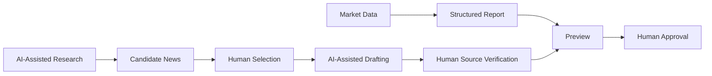

# Taylor’s Weekly Brief — AI-Assisted Market Intelligence Workflow

An AI-assisted market intelligence and publishing workflow combining Python market-data processing, AI-supported news research, human editorial judgment, source verification, structured report generation, and human-in-the-loop approval.

## What This Project Demonstrates

- Python-based market data processing and report rendering
- AI-assisted research, candidate organization and drafting
- Explicit editorial rules for freshness, relevance and source checks
- Human approval before report content is considered final
- A deterministic synthetic demo that runs offline without credentials

This is a workflow and engineering portfolio project. It does not provide personalized financial advice or claim investment performance.

## Human-in-the-Loop Workflow



| Python | AI assistant | Human editor |
|---|---|---|
| Market-data preparation and period calculations | Source discovery and candidate-news organization | Source verification |
| Structured HTML generation | Summarization and drafting assistance | News selection and market interpretation |
| Reproducible rendering | Development assistance | Editorial judgment and final approval |

AI does not independently choose what to publish. Human review remains necessary because the software does not fact-check source claims.

## Explore in Five Minutes

Python 3.11 or newer; no package installation is needed for the demo.

```bash
python src/build_report.py examples/sample_week.json
```

The command regenerates `examples/sample_output.html`. Open that file in a browser. All prices, events, sentiment values, sectors and the fictional watchlist are synthetic. The example renderer makes no network requests and does not write into an operational archive.

## Architecture and Project Structure

```text
AGENTS.md / CLAUDE.md       Short assistant entry points
README.md                   Project overview and demo
PUBLIC_READINESS_AUDIT.md   Scope and validation notes
docs/                        Editorial method and operating guide
examples/                    Synthetic JSON input and generated HTML
src/config.py                Generic market identifiers and watchlist
src/fetch_data.py            Optional online data-collection example
src/build_report.py          JSON-to-HTML renderer
templates/                   Portfolio-safe web template
scripts/check_public.py      Privacy and identifier checks
.github/workflows/ci.yml     Demo and privacy checks on three Python versions
requirements.txt             Optional online data/image dependencies
```

## Editorial Method

Candidate stories are ranked by how recently they occurred relative to the Monday-morning briefing: weekend and Friday-after-close events usually come first, followed by major Thursday/Friday developments. Ongoing policy decisions or market-leading earnings can qualify when they remain relevant. A one-day price move is generally represented in market data rather than repeated as a news item.

The assistant can organize 10–15 candidates for a human editor to select from. The count is a target, not a quota; unsupported or stale items are omitted. Read [news selection and source verification](docs/news-selection.md) for the criteria.

## Source Verification

AI-assisted discovery is a starting point. A human checks the original publication, event date, figures and whether the source supports each statement. Primary materials are preferred. The example uses fictional material and makes no claim to real sources.

## Limitations

- The optional fetcher needs an internet connection and a third-party market-data package. Provider adjustments, market holidays, time zones and futures rolls require review.
- This portfolio edition does not include production publishing credentials or infrastructure.
- The renderer accepts trusted editorial HTML; it is not a sanitizer for untrusted input.
- The report layout has fixed market display slots. Changing a data selection does not automatically reconfigure the template.
- No measured time savings, predictive accuracy or investment performance claims are made.

## Disclaimer

This repository is a personal research and engineering project for informational and educational purposes only. It is not investment advice and is not affiliated with, sponsored by, or endorsed by my employer.

Watchlist items are included for market observation and workflow demonstration only and do not constitute investment recommendations.

繁體中文操作說明與編輯方法見 [docs/workflow.md](docs/workflow.md)。
